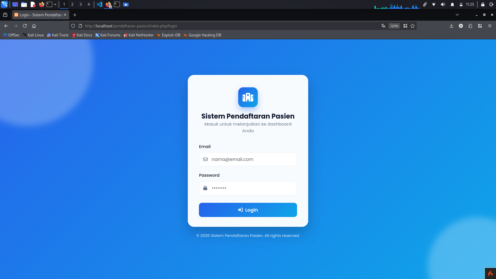
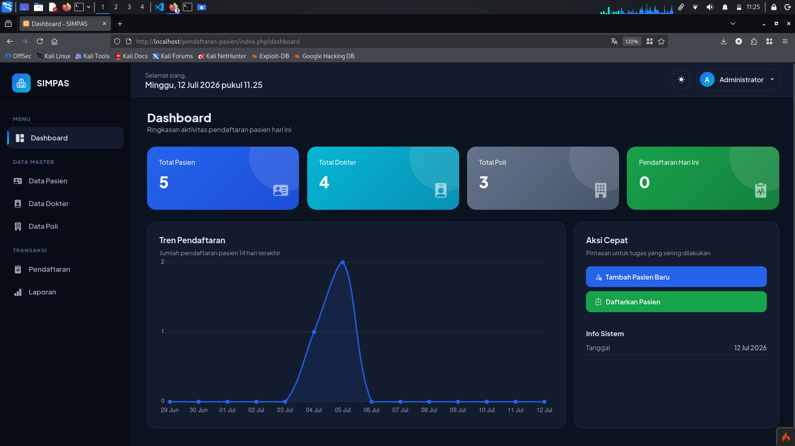
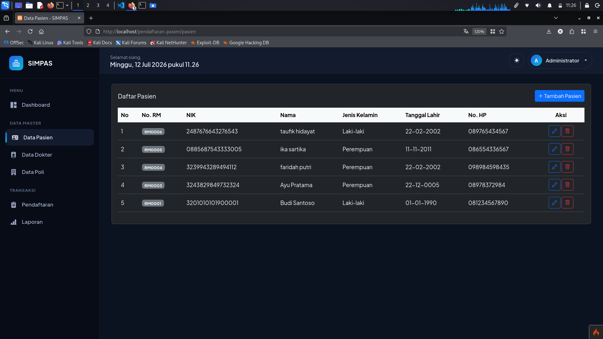
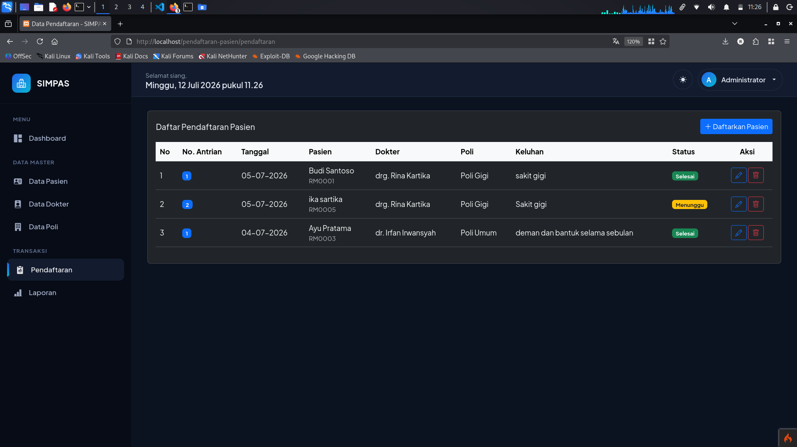

# SIMPAS - Sistem Informasi Pendaftaran Pasien

Aplikasi web sederhana berbasis **CodeIgniter 4** untuk mengelola data pasien, dokter, poli, dan pendaftaran pasien di sebuah klinik/puskesmas.

> Project ini dibuat untuk memenuhi tugas [isi: nama mata kuliah / sekolah / kampus].

## 📸 Screenshot

<!-- Ganti dengan screenshot asli tampilan aplikasi kamu -->
| Login | Dashboard |
|---|---|
|  |  |

| Data Pasien | Pendaftaran |
|---|---|
|  |  |

## ✨ Fitur

- **Autentikasi** — login untuk admin/petugas
- **Data Pasien** — tambah, lihat, ubah, hapus data pasien
- **Data Dokter** — tambah, lihat, ubah, hapus data dokter
- **Data Poli** — tambah, lihat, ubah, hapus data poli
- **Pendaftaran Pasien** — pencatatan pendaftaran pasien ke poli/dokter tertentu
- **Laporan** — rekap data pendaftaran
- **Dashboard** — ringkasan data

## 🛠️ Tech Stack

- **Framework**: CodeIgniter 4
- **Bahasa**: PHP 8.2+
- **Database**: MySQL/MariaDB
- **Frontend**: HTML, CSS, JavaScript

## 📋 Kebutuhan Sistem

- PHP 8.2 atau lebih tinggi
- Composer
- MySQL/MariaDB
- Ekstensi PHP: `intl`, `mbstring`, `json`

## 🚀 Instalasi & Menjalankan Project

1. **Clone repository**
   ```bash
   git clone https://github.com/rik0sec/-simpas-pendaftaran-pasien.git
   cd -simpas-pendaftaran-pasien
   ```

2. **Install dependency**
   ```bash
   composer install
   ```

3. **Konfigurasi environment**
   ```bash
   cp env .env
   ```
   Lalu buka `.env` dan sesuaikan bagian berikut:
   ```
   app.baseURL = 'http://localhost:8080/'

   database.default.hostname = localhost
   database.default.database = simpas_db
   database.default.username = root
   database.default.password =
   database.default.DBDriver = MySQLi
   ```

4. **Buat database**

   Buat database baru dengan nama `db_pendaftaran_pasien` di MySQL, lalu import struktur tabel:
   ```bash
   mysql -u root -p db_pendaftaran_pasien < app/Database/db_pendaftaran_pasien.sql
   ```

5. **Jalankan server**
   ```bash
   php spark serve
   ```
   Buka `http://localhost:8080` di browser.

## 📁 Struktur Project (ringkas)

```
app/
├── Controllers/
│   ├── Auth.php              # Login
│   ├── Dashboard.php         # Halaman utama
│   ├── Dokter.php            # CRUD data dokter
│   ├── Pasien.php            # CRUD data pasien
│   ├── Pendaftaran.php       # Pendaftaran pasien
│   ├── Poli.php               # CRUD data poli
│   ├── Laporan.php           # Laporan
│   └── Profil.php            # Profil user
├── Models/
│   ├── DokterModel.php
│   ├── PasienModel.php
│   ├── PendaftaranModel.php
│   ├── PoliModel.php
│   └── UserModel.php
├── Views/
│   ├── auth/                 # Halaman login
│   ├── dashboard/            # Halaman dashboard
│   ├── dokter/                # Halaman data dokter (create, edit, index)
│   ├── pasien/                # Halaman data pasien
│   ├── pendaftaran/          # Halaman pendaftaran pasien
│   ├── poli/                  # Halaman data poli
│   ├── laporan/               # Halaman laporan
│   ├── profil/                # Halaman profil user
│   └── templates/            # Layout/template bersama (header, footer, sidebar)
└── Database/
    └── db_pendaftaran_pasien.sql   # Struktur database
```

## 👤 Author

**Riko Nugroho** - 2459201107

## 📄 Lisensi

Project ini dibuat untuk keperluan tugas/pembelajaran.